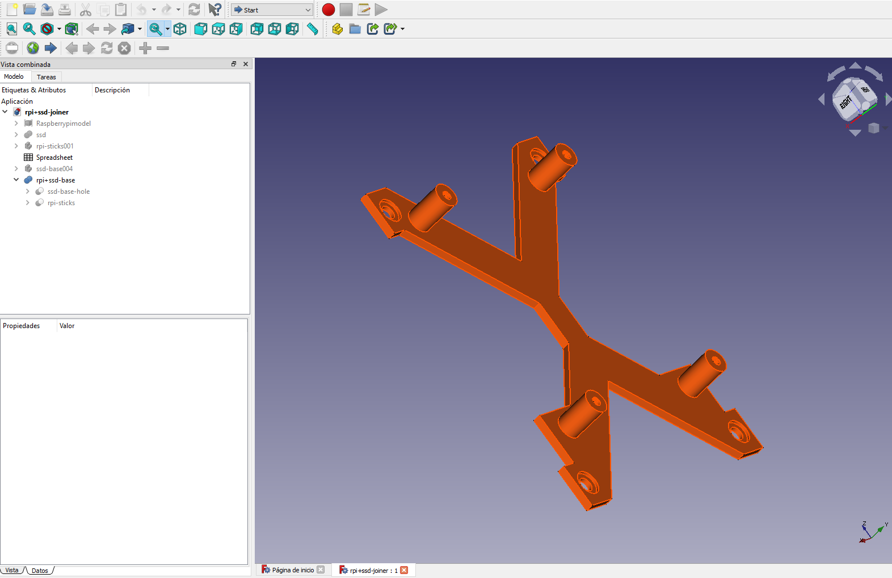
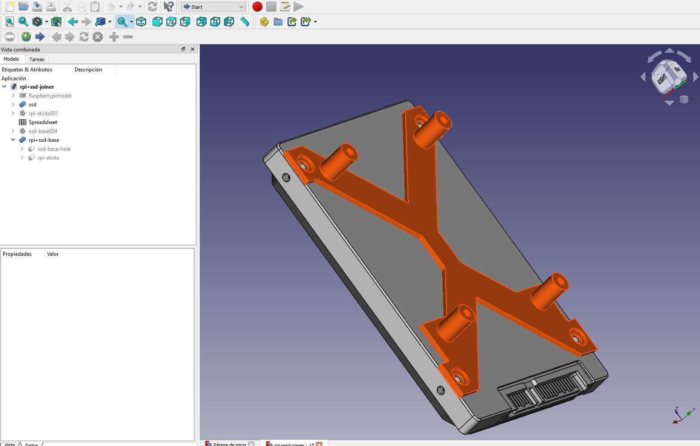
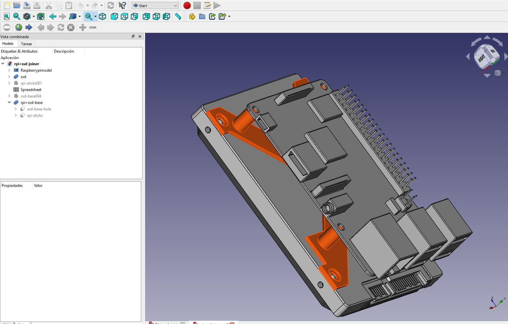
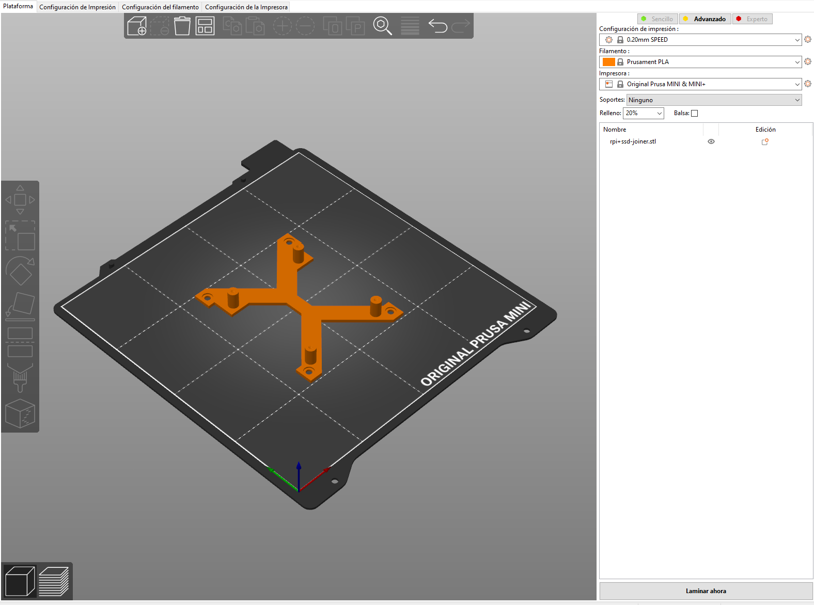
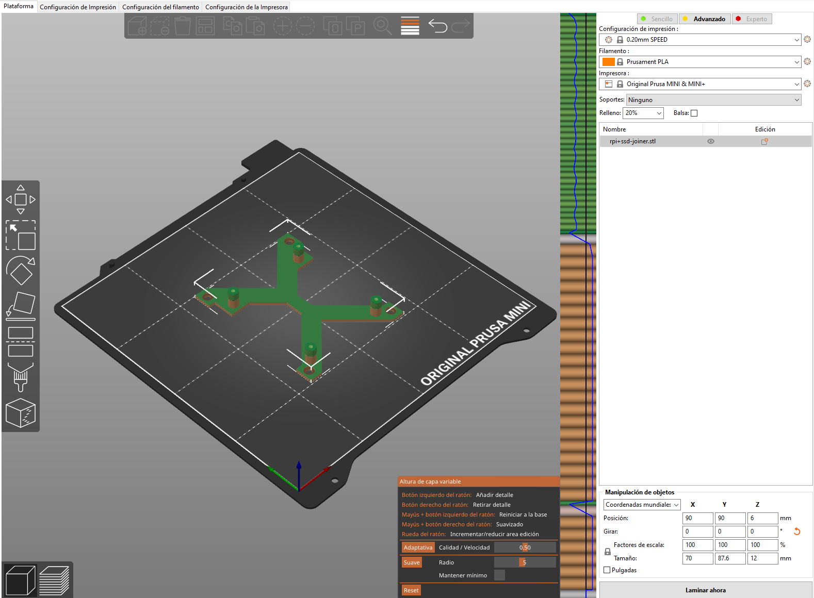
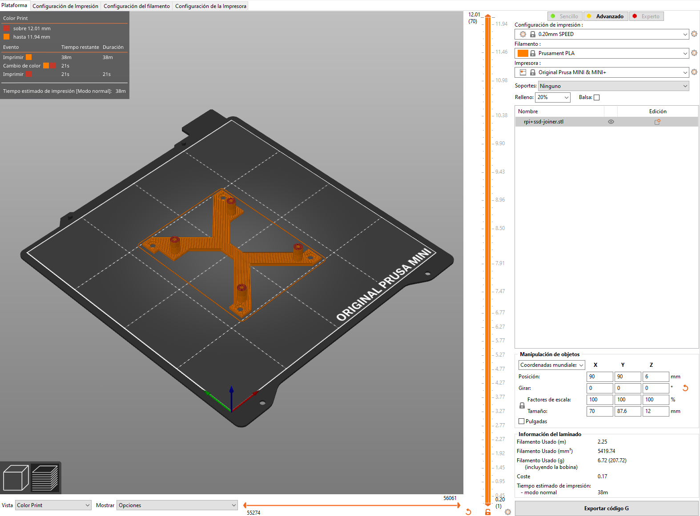

# 3d-printing-rpi-ssd-joiner

Raspberry [Pi Model B+](https://www.raspberrypi.org/products/raspberry-pi-1-model-b-plus/) SSD Joiner

## References

* https://www.raspberrypi.org/products/raspberry-pi-1-model-b-plus/
* https://static.raspberrypi.org/files/product-briefs/200206+Raspberry+Pi+3+Model+B+plus+Product+Brief+PRINT&DIGITAL.pdf
* https://www.raspberrypi.org/documentation/hardware/raspberrypi/mechanical/rpi_MECH_bplus_1p2.pdf

## Images

## License

This module is released under the GNU General Public License Version 3:

* [http://www.gnu.org/licenses/gpl-3.0-standalone.html](http://www.gnu.org/licenses/gpl-3.0-standalone.html)

## Author Information

* [Christian González Di Antonio](https://github.com/christiangda)
